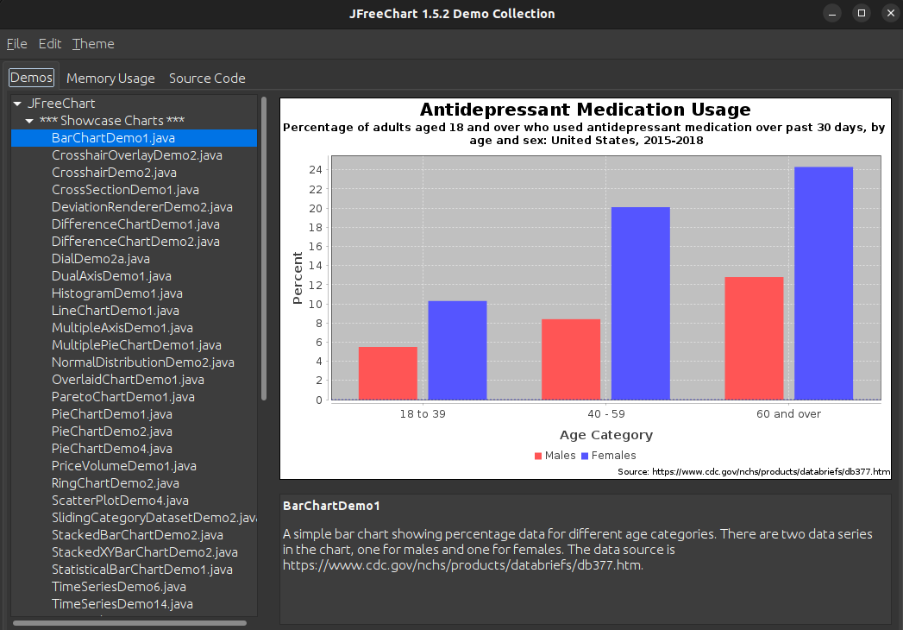
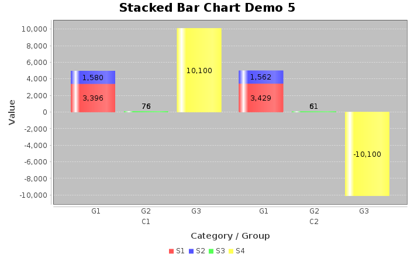
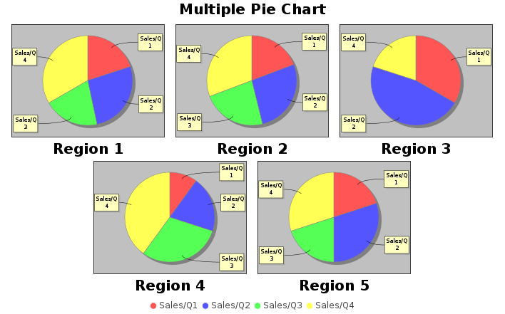

# Data Visualization Software - Java

## Run this Project

1) Download this repository and extract the file
2) Download Java JDK

      https://www.oracle.com/in/java/technologies/downloads/

3) Next, open IDE and run this command

```sh

java -jar data_visualisation.jar

```
4) Your code is successfully compiled !






